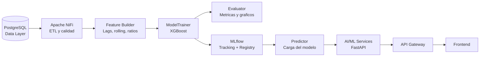
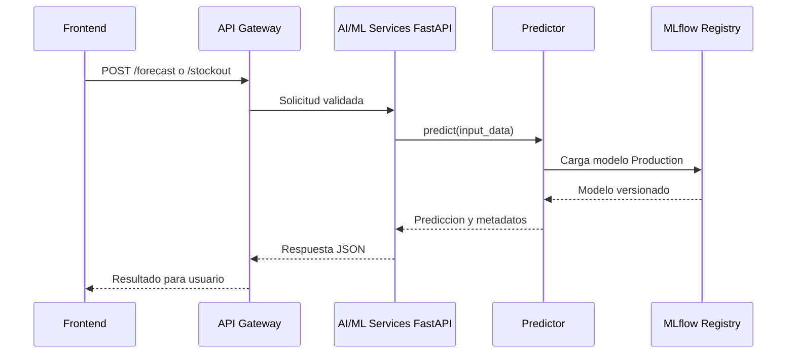

# Fábrica de ML - TFM

## Objetivo

La Fábrica de ML proporciona un flujo reproducible para convertir datos operativos de stock y supply chain en modelos entrenables y registrables. Su diseño separa la carga de datos, la construcción de variables, el entrenamiento, la evaluación y la inferencia. El objetivo es poder prototipar en un notebook y reutilizar el mismo código en reentrenamientos automáticos. MLflow centraliza los experimentos, artefactos y versiones de los modelos.

> [!note]
> La implementación actual vive en `ml_factory/` y está preparada para trabajar con PostgreSQL, XGBoost y MLflow. Apache NiFi, el servicio FastAPI de inferencia y el API Gateway forman parte de la integración objetivo.

## Arquitectura



Flujo lógico de la fábrica:

1. PostgreSQL conserva las entidades operativas y las métricas históricas.
2. NiFi puede extraer, transformar, validar y programar la disponibilidad de datos.
3. `DataLoader` obtiene el dataset mediante consultas SQL parametrizadas.
4. `FeatureBuilder` genera variables temporales, de inventario y de estacionalidad.
5. `ModelTrainer` entrena un modelo XGBoost con separación temporal.
6. `Evaluator` calcula métricas y genera artefactos de evaluación.
7. MLflow registra la ejecución, el modelo y sus parámetros.
8. `Predictor` carga una versión aprobada para servir predicciones.

## Datos de Entrada

| Tabla | Columnas clave | Uso en el modelo |
| --- | --- | --- |
| `inventory` | `product_id`, `warehouse_id`, `current_stock`, `reorder_level`, `safety_stock`, `inventory_turnover`, `stockout_risk`, `overstock_risk` | Estado actual del inventario, cobertura, riesgo de rotura y variables de reposición. |
| `logistics` | `product_id`, `supplier_id`, `warehouse_id`, `shipping_cost_usd`, `transportation_mode`, `delivery_time_days`, `on_time_delivery_rate`, `supply_disruption_risk` | Tiempo de suministro, coste logístico y riesgo de interrupción. |
| `products` | `product_id`, `product_name`, `product_category`, `brand`, `product_cost_usd`, `selling_price_usd` | Identidad, segmentación, coste y valor comercial del producto. |
| `sales` | `product_id`, `date`, `month`, `quarter`, `year`, `units_sold`, `daily_demand`, `monthly_demand`, `seasonal_demand_index`, `demand_forecast`, `predicted_reorder_quantity` | Serie temporal de demanda y targets históricos disponibles. |
| `suppliers` | `supplier_id`, `supplier_rating`, `lead_time_days`, `supplier_performance_score`, `sustainability_score` | Fiabilidad y plazo del proveedor. |
| `warehouse` | `warehouse_id`, `warehouse_location`, `storage_capacity`, `utilization_rate` | Capacidad, ubicación y saturación del almacén. |
| `supply_chain_metrics` | `product_id`, `date`, `inventory_optimization_score`, `supplier_performance_score`, `supply_chain_efficiency`, `sustainability_score`, `operational_risk_score` | Indicadores agregados para análisis y enriquecimiento futuro. |

> [!warning]
> El nombre físico de la tabla de almacenes se configura en `ml_factory/config/config.yaml`. Si la instalación utiliza `warehouses` en lugar de `warehouse`, debe ajustarse ese valor sin modificar el código del `DataLoader`.

## Modelos y Targets

### Predicción de rotura de stock

- **Tipo:** clasificación binaria.
- **Target:** `stockout_risk >= 50`; si no existe ese campo, `current_stock <= reorder_level`.
- **Features clave:** `current_stock`, `reorder_level`, `safety_stock`, `daily_demand`, lags de demanda, medias móviles, `inventory_turnover`, cobertura, `lead_time_days` y riesgos logísticos.
- **Métricas:** F1 y Accuracy como métricas principales; MAE y RMSE como indicadores auxiliares sobre la codificación 0/1.
- **Modelo previsto:** `XGBClassifier`.

### Recomendación de cantidad de compra

- **Tipo:** regresión.
- **Target:** `predicted_reorder_quantity`; como fallback, `max(reorder_level - current_stock, 0)`.
- **Features clave:** stock actual, punto de reposición, stock de seguridad, demanda reciente, cobertura, rotación, plazo de proveedor, capacidad de almacén y coste logístico.
- **Métricas:** MAE para el error medio interpretable y RMSE para penalizar errores grandes.
- **Modelo previsto:** `XGBRegressor`.

### Forecasting de demanda

- **Tipo:** series temporales de demanda; requiere un pipeline específico de horizonte y validación temporal.
- **Target recomendado:** `daily_demand`, `monthly_demand` o `units_sold` en el horizonte futuro.
- **Features clave:** lags, medias móviles, mes, trimestre, día de la semana, estacionalidad, producto, almacén y señales de ventas.
- **Métricas:** MAE y RMSE; añadir MAPE o WAPE cuando los valores reales no sean cero.
- **Estado:** extensión prevista de la fábrica; el pipeline base actual cubre `stockout` y `reorder`.

| Target | Problema | Modelo | Métricas principales |
| --- | --- | --- | --- |
| `stockout` | Clasificación binaria | `XGBClassifier` | F1, Accuracy |
| `reorder` | Regresión | `XGBRegressor` | MAE, RMSE |
| `demand_forecast` | Serie temporal | XGBoost u otro modelo temporal | MAE, RMSE, WAPE |

## Estructura del Proyecto

```text
ml_factory/
├── __init__.py
├── config/
│   ├── __init__.py
│   └── config.yaml
├── data/
│   ├── __init__.py
│   ├── db_connection.py
│   └── data_loader.py
├── features/
│   ├── __init__.py
│   └── feature_builder.py
├── models/
│   ├── __init__.py
│   ├── trainer.py
│   ├── evaluator.py
│   └── predictor.py
├── pipelines/
│   ├── __init__.py
│   └── training_pipeline.py
├── utils/
│   ├── __init__.py
│   └── logger.py
├── notebooks/
│   └── 01_exploration.ipynb
├── tests/
│   ├── __init__.py
│   └── test_features.py
├── requirements.txt
└── main.py
```

## Flujo de Entrenamiento

1. **Carga de configuración:** `TrainingPipeline` lee `config.yaml`, variables de entorno y parámetros de MLflow.
2. **Conexión a datos:** `DataLoader` crea un engine SQLAlchemy y ejecuta consultas parametrizadas.
3. **Unión de entidades:** `get_joined_dataset()` combina ventas, productos, inventario, logística, proveedores y almacenes.
4. **Orden temporal:** el dataset se ordena por producto, almacén y fecha para evitar leakage temporal.
5. **Construcción de features:** se calculan lags, rolling windows, calendario, rotación y cobertura.
6. **Construcción del target:** se genera `target` para `stockout` o `reorder`.
7. **Preprocesamiento:** las categóricas se codifican con one-hot y los valores faltantes se imputan con la mediana.
8. **Split temporal:** el último tramo de observaciones se reserva como test; no se mezclan datos aleatoriamente.
9. **Entrenamiento:** XGBoost aprende sobre el tramo temporal de entrenamiento.
10. **Evaluación:** se calculan MAE, RMSE, F1 y Accuracy según el tipo de tarea.
11. **Registro:** MLflow guarda parámetros, métricas, artefactos y el modelo registrado.
12. **Promoción:** una versión validada puede pasar al stage o alias `Production`.

Ejemplo de ejecución:

```bash
python -m pip install -r ml_factory/requirements.txt
python -m ml_factory.main --target stockout
python -m ml_factory.main --target reorder
```

## Métricas y Evaluación

| Métrica | Definición conceptual | Cuándo usarla |
| --- | --- | --- |
| MAE | Promedio del valor absoluto del error. | Cuando se necesita un error medio fácil de interpretar en unidades del negocio. |
| RMSE | Raíz del promedio de errores al cuadrado. | Cuando los errores grandes deben penalizarse más. |
| F1 | Media armónica entre precision y recall. | En `stockout`, especialmente cuando hay desbalance entre roturas y no roturas. |
| Accuracy | Proporción total de predicciones correctas. | Cuando las clases están razonablemente balanceadas; no debe usarse sola con clases desbalanceadas. |

El `Evaluator` también genera:

- Matriz de confusión para clasificación.
- Importancia de variables del modelo.
- Gráfico de residuales para regresión y forecasting.

> [!tip]
> Para stockout conviene priorizar el recall de la clase positiva si el coste de no detectar una rotura es mayor que el de generar una alerta adicional. La métrica de negocio debe definirse junto con el coste de falsos positivos y falsos negativos.

## Reentrenamiento Automático

El reentrenamiento puede ejecutarse mediante un Scheduled Job de un orquestador, cron, Airflow, NiFi o un worker del backend. El job debe:

1. Verificar que existe una ventana mínima de datos nuevos.
2. Ejecutar `python -m ml_factory.main --target <target>`.
3. Crear una ejecución MLflow dentro del experimento configurado.
4. Registrar parámetros, métricas, código y artefactos.
5. Comparar el modelo nuevo con el modelo actualmente productivo.
6. Promoverlo a `Production` solo si supera los umbrales definidos.
7. Notificar el resultado y conservar el modelo anterior para rollback.

Ejemplo de job programado:

```bash
# Ejemplo conceptual de cron: cada domingo a las 02:00
0 2 * * 0 cd /ruta/StockAssistant-Jupiter && \
  /ruta/.venv/bin/python -m ml_factory.main --target stockout
```

MLflow asigna un `run_id` a cada ejecución y guarda la versión del modelo en el Model Registry mediante `registered_model_name`. El `Predictor` carga el modelo promovido mediante una URI como:

```python
models:/stockout-predictor/Production
```

> [!warning]
> No se debe promocionar automáticamente un modelo solo porque el entrenamiento terminó. La promoción debe estar condicionada a métricas, validación de datos, revisión de drift y reglas de negocio.

## Integración con el Sistema

El flujo de inferencia previsto es:



El `Predictor` recibe un diccionario o `DataFrame`, lo adapta al formato del modelo y devuelve la predicción. El servicio FastAPI debe encargarse de:

- Validar el payload con modelos Pydantic.
- Comprobar autenticación y autorización.
- Cargar el predictor al iniciar o mediante caché.
- Devolver predicción, versión del modelo, timestamp y trazabilidad.
- Registrar latencia, errores, distribución de inputs y drift.

El API Gateway centraliza routing, rate limiting, CORS, autenticación externa y observabilidad antes de enviar la petición al servicio de ML.

## Notas y Decisiones

- La separación temporal se utiliza para evitar leakage entre pasado y futuro.
- Los nombres de tablas se mantienen configurables en `config.yaml`.
- Las consultas SQL seleccionan columnas explícitas para evitar dependencias accidentales del esquema.
- La API key y los secretos de MLflow/PostgreSQL deben llegar mediante variables de entorno, nunca desde el repositorio.
- El target `stockout` usa `stockout_risk` cuando está disponible y aplica un fallback basado en stock y reorder level.
- El target `reorder` usa `predicted_reorder_quantity` y tiene un fallback determinista.
- Las features categóricas se transforman mediante one-hot encoding.
- Debe definirse una estrategia para persistir el esquema de columnas generado durante entrenamiento y aplicarlo idénticamente en inferencia.
- Las tablas de producción y los datos de validación deben permanecer separados.
- Las siguientes decisiones quedan pendientes de documentar:
  - [ ] Horizonte de forecasting.
  - [ ] Frecuencia mínima de reentrenamiento.
  - [ ] Umbrales de promoción a producción.
  - [ ] Métricas de negocio y costes de error.
  - [ ] Política de rollback.
  - [ ] Estrategia de monitorización de drift.

## Enlaces Relacionados

- [[Arquitectura General TFM]]
- [[Tablas Base de Datos]]
- [[MLflow Setup]]
- [[FastAPI Forecasting Service]]
- [[Reentrenamiento y Monitoreo]]

## Checklist de Implementación

- [x] Crear estructura modular de `ml_factory/`.
- [x] Implementar conexión SQLAlchemy a PostgreSQL.
- [x] Implementar carga de tablas y dataset unido.
- [x] Implementar lags y ventanas móviles.
- [x] Implementar features de estacionalidad.
- [x] Implementar ratios de inventario.
- [x] Implementar targets `stockout` y `reorder`.
- [x] Implementar split temporal.
- [x] Integrar XGBoost.
- [x] Integrar tracking y Model Registry de MLflow.
- [x] Crear evaluador con métricas y gráficos.
- [x] Crear notebook de exploración.
- [x] Crear tests unitarios de features.
- [ ] Levantar un servidor MLflow persistente.
- [ ] Añadir servicio FastAPI de inferencia.
- [ ] Añadir API Gateway.
- [ ] Integrar Apache NiFi.
- [ ] Automatizar el Scheduled Job.
- [ ] Añadir monitorización de drift.
- [ ] Definir promoción y rollback de modelos.
- [ ] Ejecutar pruebas end-to-end con datos de validación.

## Referencias

- [XGBoost Python API](https://xgboost.readthedocs.io/en/stable/python/python_api.html)
- [XGBoost Parameters](https://xgboost.readthedocs.io/en/stable/parameter.html)
- [MLflow Tracking](https://mlflow.org/docs/latest/ml/tracking/)
- [MLflow Model Registry](https://mlflow.org/docs/latest/ml/model-registry/)
- [MLflow Python API](https://mlflow.org/docs/latest/python_api/mlflow.html)
- [Scikit-learn Metrics](https://scikit-learn.org/stable/modules/model_evaluation.html)
- [Scikit-learn TimeSeriesSplit](https://scikit-learn.org/stable/modules/generated/sklearn.model_selection.TimeSeriesSplit.html)
- [SQLAlchemy Documentation](https://docs.sqlalchemy.org/)
- [Apache NiFi Documentation](https://nifi.apache.org/documentation/)
- [FastAPI Documentation](https://fastapi.tiangolo.com/)
- [Obsidian Help: Properties](https://help.obsidian.md/properties)
- [Obsidian Help: Callouts](https://help.obsidian.md/callouts)
- [Obsidian Help: Mermaid](https://help.obsidian.md/advanced-syntax/mermaid)
